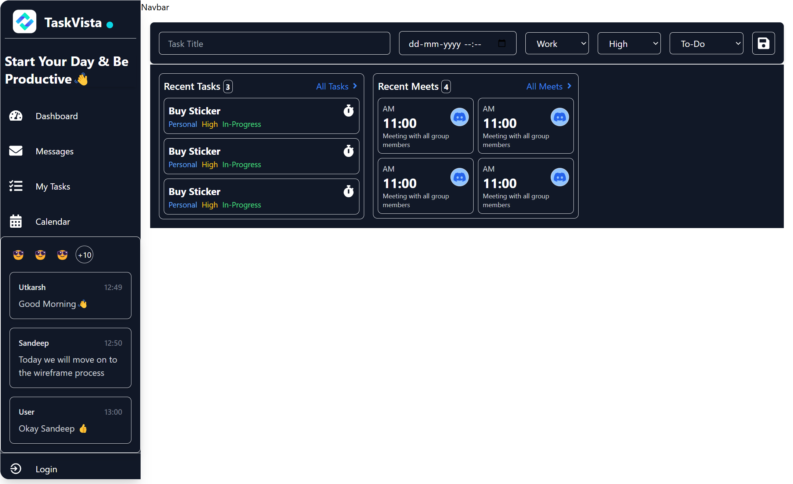

## Technologies Used
- **React** for building the user interface.
- **TailwindCSS** for styling and responsive design.
- **React-Big-Calendar** for managing and displaying calendar events.
- **React Calendar** for date-specific task viewing.

## Key Features

### Sidebar with Hover Expansion
- **Hover Expansion:** The sidebar automatically expands when hovered over, showing full navigation labels for easy access to features like Dashboard, Messages, My Tasks, and Calendar.
- **Compact Mode:** On mouse leave, the sidebar collapses into a compact mode, showing only the icons to save screen space, making it ideal for users who prefer a minimalistic interface.
- **Smooth Transitions:** The sidebar offers smooth transitions and animations when expanding or collapsing, ensuring a seamless user experience.

### Global Context for Theme Management
- **Dark/Light Mode System:** The app includes a global context to handle the theme mode, allowing users to switch between dark and light modes. This enhances accessibility and user comfort, especially in low-light environments.
- **Theme Toggle:** The dark/light mode can be toggled globally across the app, ensuring consistent visual preferences for users.
- **Responsive UI:** The theme system is fully responsive, adjusting automatically according to the user's preference or system settings.

### Task Management

- **AddTaskForm:** 
  - **Task Input Fields:** Created a form to add tasks with fields for Title, Date & Time, Category, Priority, and Status.
  - **Form Submission:** On form submission, the task data is captured and displayed.

- **Recent Task & Recent Meeting UI:**
  - **Recent Task:** Displays task details like title, category, priority, and status.
  - **Recent Meeting:** Shows meeting details, including time, platform (e.g., Discord), and description.
  - **Timer for Deadlines:** A countdown timer for task deadlines and meeting times is included to keep users updated.

### Calendar Integration
- **Big Calendar:** The app integrates a big calendar to show the entire meeting schedule, with the ability to view events by specific dates.
- **React Calendar:** This calendar allows users to navigate through dates and view tasks assigned to those specific days.

### Reminder Section
- **Task Reminders:** A reminder feature helps users stay on track with short tasks, alerting them before the task's timing.
- **Meeting Reminder:** Alerts are also provided for upcoming meetings, ensuring users never miss an important event.

