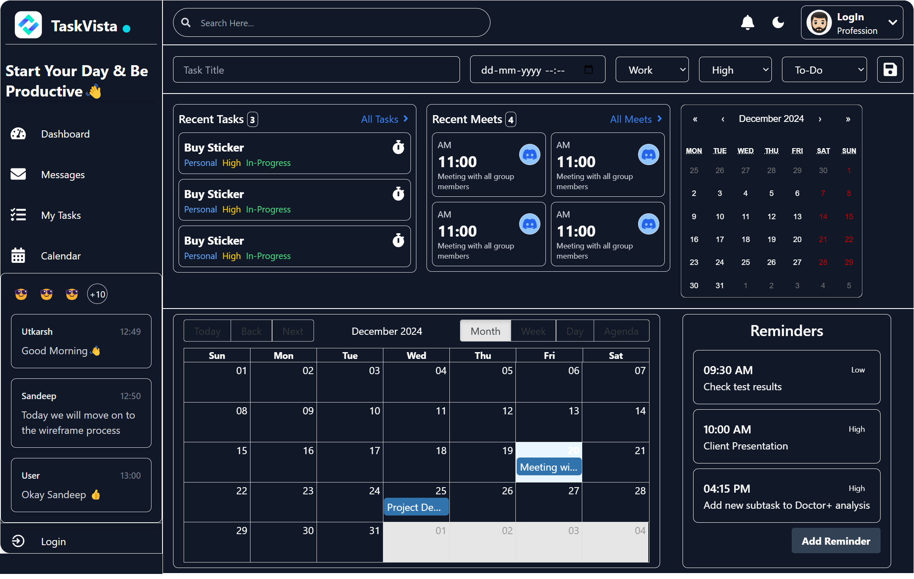
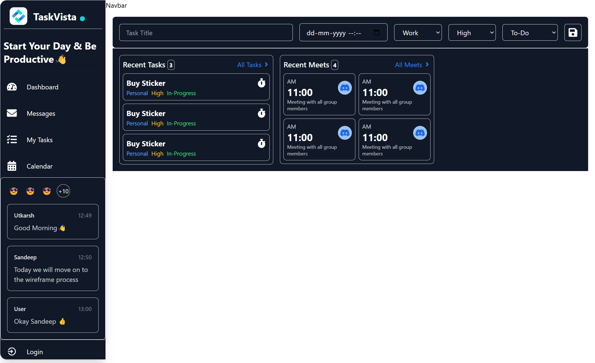

## Technologies Used
- **React**: For building the user interface with a component-based architecture.
- **TailwindCSS**: For styling and ensuring a responsive design across devices.
- **React-Big-Calendar**: For managing and displaying calendar events in a user-friendly layout.
- **React Calendar**: For date-specific task viewing, allowing users to navigate and view tasks by day.
- **Firebase**: For real-time data fetching and storage, ensuring that task and meeting data is always up-to-date.
- **React Context API**: For managing global states like theme preferences, user authentication, and data fetching.
- **React Router**: For handling navigation and routing between different pages of the app, providing a smooth user experience.

## Key Features

### Sidebar with Hover Expansion
- **Hover Expansion:** The sidebar automatically expands when hovered over, showing full navigation labels for easy access to features like Dashboard, Messages, My Tasks, and Calendar.
- **Compact Mode:** On mouse leave, the sidebar collapses into a compact mode, showing only the icons to save screen space, making it ideal for users who prefer a minimalistic interface.
- **Smooth Transitions:** The sidebar offers smooth transitions and animations when expanding or collapsing, ensuring a seamless user experience.

### Global Context for Theme Management
- **Dark/Light Mode System:** The app includes a global context to handle the theme mode, allowing users to switch between dark and light modes. This enhances accessibility and user comfort, especially in low-light environments.
- **Theme Toggle:** The dark/light mode can be toggled globally across the app, ensuring consistent visual preferences for users.
- **Responsive UI:** The theme system is fully responsive, adjusting automatically according to the user's preference or system settings.

### Task Management

- **AddTaskForm:** 
  - **Task Input Fields:** Created a form to add tasks with fields for Title, Date & Time, Category, Priority, and Status.
  - **Form Submission:** On form submission, the task data is captured and displayed.

- **Recent Task & Recent Meeting UI:**
  - **Recent Task:** Displays task details like title, category, priority, and status.
  - **Recent Meeting:** Shows meeting details, including time, platform (e.g., Discord), and description.
  - **Timer for Deadlines:** A countdown timer for task deadlines and meeting times is included to keep users updated.

### Calendar Integration
- **Big Calendar:** The app integrates a big calendar to show the entire meeting schedule, with the ability to view events by specific dates.
- **React Calendar:** This calendar allows users to navigate through dates and view tasks assigned to those specific days.

### Reminder Section
- **Task Reminders:** A reminder feature helps users stay on track with short tasks, alerting them before the task's timing.
- **Meeting Reminder:** Alerts are also provided for upcoming meetings, ensuring users never miss an important event.

## Real-Time Data with Firebase
- **Firebase API Integration**: Data is fetched and rendered in real-time using Firebase, ensuring that any task or meeting updates are immediately reflected in the user interface.
- **Data Fetching**: On page load or after submitting a new task or meeting, the app fetches the latest data from Firebase to keep the display up-to-date.

## Routing and Protected Routes
- **React Router**: Used for routing between pages, providing an organized structure for navigating through the app’s pages (e.g., Dashboard, Task List, Calendar).
- **Protected Routes**: Routes are protected using global context for authentication, preventing unauthorized access to certain pages. Users must be authenticated to view specific content.

## Authentication and Global Context
- **Global Context for Authentication**: The app uses React’s Context API to manage user authentication globally. Users can log in, log out, and access protected pages based on their authentication status.
- **Real-Time Data Fetching**: The app uses Firebase to fetch data in real-time, ensuring that users always see the latest information without needing to refresh the page.

## Conclusion
TaskVista is a feature-rich task management tool, built with modern web technologies to provide a seamless, real-time experience. Whether it's managing tasks, meetings, or reminders, TaskVista ensures that users stay on top of their schedules with ease and efficiency.

